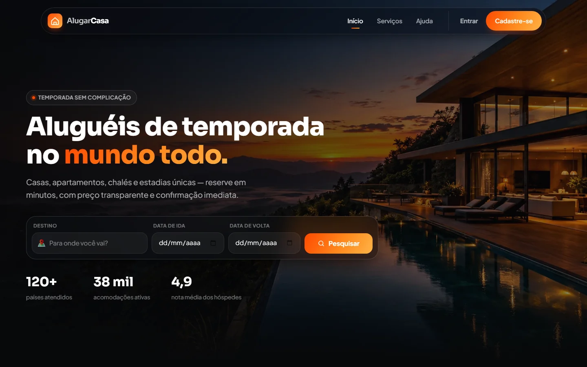
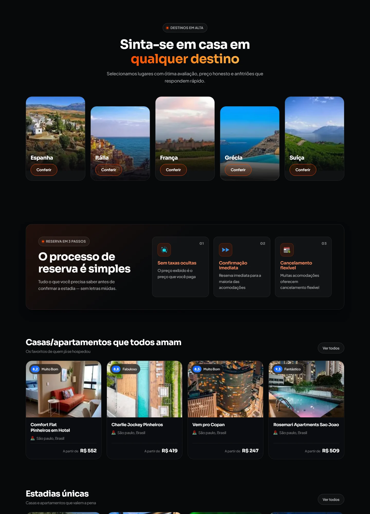

<h1 align="center">AlugarCasa</h1>

<p align="center">
  Landing page de aluguéis de temporada — escura, moderna e cheia de microinterações.
  <br>
  <strong>O lugar certo pra encontrar o lugar perfeito.</strong>
</p>

<p align="center">
  <a href="https://home-space-brown.vercel.app/"><strong>🔗 Ver o projeto no ar</strong></a>
</p>

<p align="center">
  
  
  
  
</p>



<details>
  <summary><strong>Ver as demais seções</strong></summary>

  <br>

  

</details>

---

## Sobre

Landing page construída em **Angular 17** com foco em desempenho, acessibilidade e SEO,
sem framework de CSS: todo o visual é CSS puro, organizado sobre um sistema de design
próprio em custom properties.

A interface é dark por padrão, com paleta em gradiente laranja, superfícies de vidro
(`backdrop-filter`) e um conjunto de interações que respondem ao cursor.

## O que tem aqui

- **Header flutuante em vidro** que encolhe ao rolar, com *scroll-spy* marcando a seção ativa e menu lateral no mobile.
- **Hero** com busca em vidro (destino, ida, volta), foco encadeado nos campos e indicadores numéricos.
- **Carrosséis de destinos e acomodações** com `scroll-snap`, virando grade no desktop.
- **Cards com inclinação 3D** que seguem o ponteiro, brilho radial, borda que acende e conteúdo elevado em Z.
- **Animações de entrada** por `IntersectionObserver`, com atraso escalonado por item.
- **Accordion de ajuda** em `<details>` nativo, com chevron animado.
- **Rodapé completo**: newsletter, colunas de links, redes sociais em SVG inline e voltar ao topo.

## Detalhes de implementação

### Sistema de design

Todo o tema vive em custom properties no `:root` de [`src/styles.css`](src/styles.css) —
cores de marca, superfícies, bordas, raios, sombras, curva de *easing*, larguras e
tipografia. Trocar a marca inteira é mexer em um bloco só.

```css
--brand-gradient: linear-gradient(120deg, #ff4800 0%, #ff8a1e 55%, #ffb347 100%);
--ease: cubic-bezier(.22, 1, .36, 1);
```

Sobre eles existem utilitários reaproveitados em todas as seções: `.spot` (brilho que
segue o cursor), `.ring` (borda em gradiente via `mask-composite`), `.tilt` (inclinação 3D),
`.shine` (varredura de luz em botões) e `.lift` (conteúdo que flutua acima do card).

### Diretivas

Duas diretivas standalone concentram o comportamento e são compartilhadas entre os componentes:

| Diretiva | Arquivo | O que faz |
| --- | --- | --- |
| `data-reveal` | [`reveal.directive.ts`](src/app/shared/directives/reveal.directive.ts) | Revela o elemento ao entrar na viewport via `IntersectionObserver`, com atraso por `[revealDelay]` e *fallback* caso o observer não dispare. |
| `appSpotlight` | [`spotlight.directive.ts`](src/app/shared/directives/spotlight.directive.ts) | Expõe `--mx/--my` (posição do ponteiro) e `--rx/--ry` (rotação 3D) para o CSS, com `requestAnimationFrame` e sem efeito em toque. |

```html
<article class="card spot ring tilt" appSpotlight tilt data-reveal [revealDelay]="i * 90">
```

### Angular moderno

- **Componentes standalone** em toda a aplicação, sem `NgModule`.
- **Signals** (`signal<T>()`) para os dados das seções.
- **Novo control flow** `@for` / `@if` nos templates, com `track` explícito.
- Sem biblioteca de estado ou de UI — o bundle inicial fica em torno de **74 KB** comprimido.

### Acessibilidade e performance

- Imagens em **WebP** com `loading="lazy"` e `aspect-ratio` reservado (sem *layout shift*).
- `prefers-reduced-motion` desliga inclinação, varredura e animações de entrada.
- Inclinação e brilho são desativados em `pointer: coarse`, para não pesar no mobile.
- `:focus-visible` visível em todos os interativos, `aria-label`/`aria-expanded` no menu, marcação semântica (`header`, `nav`, `section`, `article`, `footer`).
- Metatags de descrição, autor, `robots`, `theme-color` e `color-scheme` no [`index.html`](src/index.html).

## Estrutura

```
src/
├─ app/
│  ├─ shared/directives/      # reveal + spotlight (reutilizadas nas seções)
│  └─ modules/homeSpace/
│     ├─ pages/inicio/        # página: monta as seções + rodapé
│     ├─ sections/            # home (hero), services, about
│     ├─ components/          # menu, paises, descricao, apartamentos
│     └─ interface/           # contratos de dados de cada bloco
├─ assets/                    # imagens (webp) e ícones
└─ styles.css                 # design tokens + utilitários globais
```

## Rodando localmente

Precisa de **Node 18+** e npm.

```bash
git clone https://github.com/desafiogamer/AlugarCasa.git
cd AlugarCasa
npm install
npm start
```

Acesse `http://localhost:4200/`.

### Scripts

| Comando | O que faz |
| --- | --- |
| `npm start` | Servidor de desenvolvimento com *live reload*. |
| `npm run build` | Build de produção em `dist/alugar-casa`. |
| `npm run watch` | Build de desenvolvimento em modo *watch*. |
| `npm test` | Testes unitários com Karma/Jasmine. |

## Tecnologias

<p>
  <a href="https://angular.io" target="_blank" rel="noreferrer"></a>
  <a href="https://www.typescriptlang.org/" target="_blank" rel="noreferrer"></a>
  <a href="https://www.w3.org/html/" target="_blank" rel="noreferrer"></a>
  <a href="https://www.w3schools.com/css/" target="_blank" rel="noreferrer"></a>
</p>

## Autor

Feito por **João Vitor Gentil da Silva** — [@desafiogamer](https://github.com/desafiogamer)
